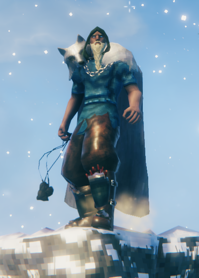



Catch your prey with a reusable bola. Bind ground creatures or bring flying enemies down to earth.

## Features

- Craft a bola with **3 Flint and 2 Leather Scraps**. No workbench required.
- Hold attack to charge, release to throw, or press block to cancel.
- Holds creatures in place for **6 seconds**, followed by **8 seconds of immunity**. They can still turn and attack.
- Flying creatures descend before the binding timer starts.
- Deals no damage by default. Pick up your bola and use it again.
- Bow skill reduces charge time and stamina cost.
- Players, tamed creatures, bosses and selected large creatures are excluded by default.

## Current test build

Animations are still being improved.

Requires **BepInExPack Valheim 5.4.2350** and **Jotunn 2.30.2** or newer.
Settings are in `BepInEx/config/norskit_bola_plugin.cfg` after the first launch.
